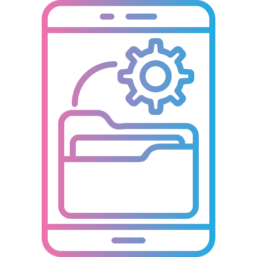

# YourHr

Job Search Service App **made with NextJs**:

[Github](https://github.com/mukut-d/yourhr-kudosware.git)
[Live](https://yourhr-kudosware.vercel.app/)



## Features

Create a Markdown file at `docs/hello.md`:

```md title="docs/hello.md"
• Your Hr web app made with Nextjs. YourHR
is a job search service that aims to help job
seekers find the ideal job roles based on their
qualifications and preferences.
• a web application that allows job seekers to fill out a signup form with their personal information and upload their resume.
• includes a backend that securely stores the
user information and resumes in a database.
• has a responsive website

This is my **first Docusaurus document**!
```

A new document is now available at [http://localhost:3000/docs/hello](http://localhost:3000/docs/hello).

## Tech Stack

Tech Stack used :-


```
const list = [
    {id:1, tech: React},
    {id:2 ,tech: Javascript},
    {id:3, tech: Html},
    {id:4 , tech: Css},
    {id:5, tech: NextJs},
    {id:6, tech: Nodejs},
    {id:7, tech: Sql-lite}
 ]


 console.log(list);
```
